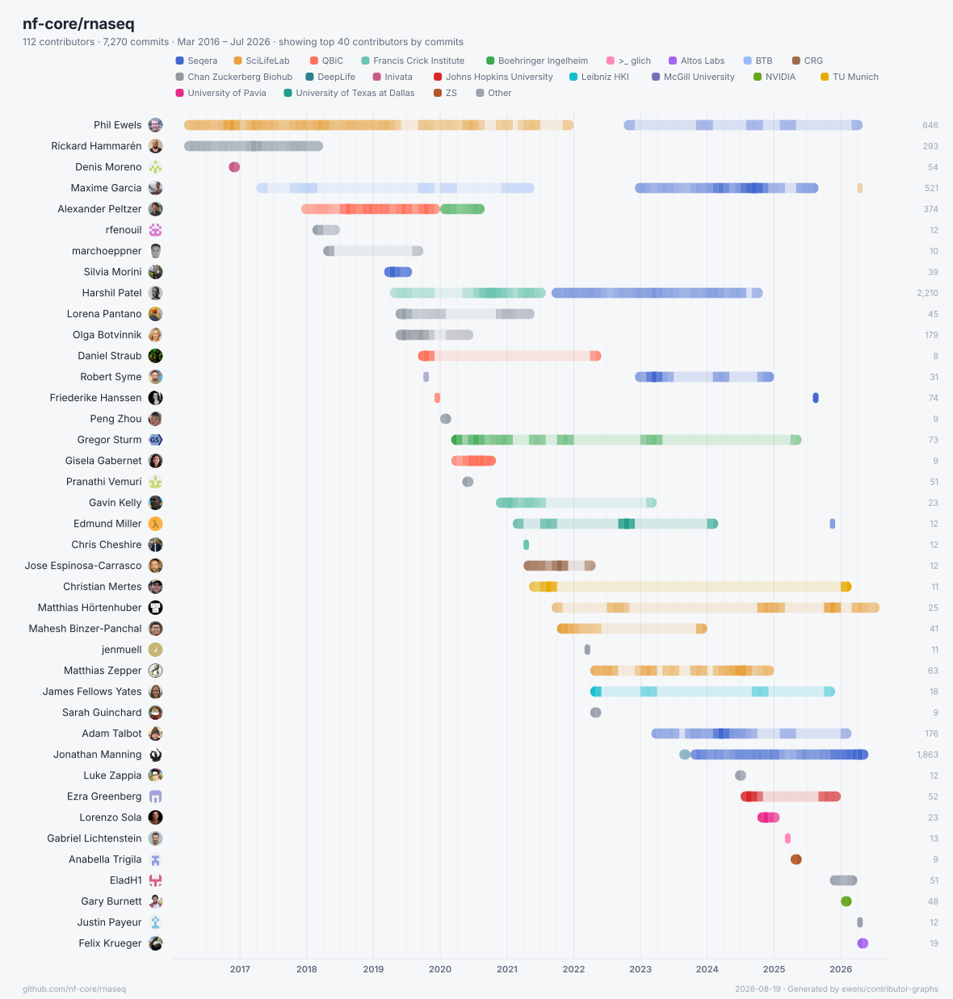

<p align="center">
  <picture>
    <source media="(prefers-color-scheme: dark)" srcset="docs/logo-dark.svg">
    
  </picture>
</p>

<p align="center">
  Contributor timelines for any git or GitHub repository — a publication-ready
  SVG and a self-contained interactive HTML page.
</p>

<p align="center">
  <a href="https://github.com/ewels/contributor-graphs/actions/workflows/ci.yml"></a>
  <a href="LICENSE"></a>
  <a href="https://ewels.github.io/contributor-graphs/"></a>
</p>

The x-axis is time (first commit → today); each row is a contributor. Bars are
shaded by monthly commit activity, so you can see at a glance who was active
when, who carried a project, and how a community grew over the years.

<p align="center">
  <picture>
    <source media="(prefers-color-scheme: dark)" srcset="docs/example-rnaseq-dark.svg">
    
  </picture>
</p>

<p align="center">
  <b><a href="https://ewels.github.io/contributor-graphs/">Documentation &amp; live examples →</a></b>
</p>

## Features

- **Works with anything** — a local path (`.`), a GitHub slug (`nf-core/rnaseq`),
  or any git URL. Remote repos are cloned (history only) into a local cache.
- **GitHub enrichment** — resolves real names, `@usernames` and avatars via the
  GitHub API, using your `gh` CLI token automatically to avoid rate limits.
- **Identity merging** — folds together the many name and email spellings a
  single person accumulates over the years, with a manual override file for the
  stragglers.
- **Affiliation grouping** — auto-detects organisations from GitHub profile
  companies (e.g. _SciLifeLab_, _Seqera_) and colours by them. Optionally
  **collapse the whole chart to one row per affiliation**, so each bar is an
  organisation rather than a person. Supply your own grouping file for control.
- **Noise filters** — exclude bots, set a minimum-commit threshold, cap to the
  top _N_ contributors. In the HTML these are live controls.
- **Interactive HTML** — search, sort, filter by group, switch between
  per-contributor and per-affiliation rows, drag-to-zoom the timeline, hover
  for detail + activity sparkline, dark mode, and SVG/PNG export. Everything is
  embedded in one file; no server needed.

## Install

Grab a prebuilt binary, install with Cargo, or use Docker. The
[GitHub CLI](https://cli.github.com) (`gh`) is optional but recommended for
enrichment without rate limits.

**Prebuilt binary** — download the archive for your platform from the
[releases page](https://github.com/ewels/contributor-graphs/releases), unpack
it, and put `contributor-graphs` on your `PATH`. No toolchain required.

**Cargo** (needs [Rust](https://rustup.rs)):

```bash
cargo install --git https://github.com/ewels/contributor-graphs  # latest
cargo install contributor-graphs                                 # once on crates.io
```

**Docker** — published to the GitHub Container Registry:

```bash
docker run --rm -v "$PWD:/work" -e GITHUB_TOKEN \
  ghcr.io/ewels/contributor-graphs nf-core/rnaseq
```

## Usage

```bash
# A GitHub repo by slug — clones history, enriches, writes two files
contributor-graphs nf-core/rnaseq

# A local checkout
contributor-graphs . -o docs/

# A full git URL
contributor-graphs https://github.com/MultiQC/MultiQC
```

This writes `<repo>.svg` and `<repo>.html` into the output directory.

### Authentication

To enrich with usernames and avatars (and dodge GitHub's anonymous rate limit),
the tool reads a token from `$GITHUB_TOKEN`, `$GH_TOKEN`, or — if neither is set
— runs `gh auth token`. Locally, just be logged in:

```bash
gh auth login
```

In CI, the `$GITHUB_TOKEN` that GitHub Actions injects is picked up
automatically — no extra setup needed:

```yaml
- run: contributor-graphs ${{ github.repository }} -o site/
  env:
    GITHUB_TOKEN: ${{ secrets.GITHUB_TOKEN }}
```

Pass `--no-github` to skip all network calls and render from git data alone.

## Common options

| Flag                                | Description                                                          |
| ----------------------------------- | -------------------------------------------------------------------- |
| `-o, --output-dir <DIR>`            | Where to write outputs (default: `.`)                                |
| `--title <TITLE>`                   | Override the chart title                                             |
| `-b, --branch <REF>`                | Which branch/ref to read (default: `HEAD`)                           |
| `--since <DATE>` / `--until <DATE>` | Restrict the commit window                                           |
| `--min-commits <N>`                 | Hide contributors below `N` commits in the SVG (default: 1)          |
| `--min-span-days <N>`               | Drop one-off/short-burst contributors (first→last span) from the SVG |
| `--max-contributors <N>`            | Cap SVG rows to the top `N` by commits (default: 40)                 |
| `--include-bots`                    | Keep bot accounts (excluded by default)                              |
| `--exclude <PATTERN>`               | Drop contributors matching a name/login (repeatable)                 |
| `--by-affiliation`                  | Collapse each row to a whole affiliation, not one person             |
| `--unaffiliated-label <TEXT>`       | Bucket name for people with no affiliation (default: `Unaffiliated`) |
| `--sort <KEY>`                      | `first` · `last` · `commits` · `duration` · `name`                   |
| `--groups <FILE>`                   | Manual affiliation mapping (see below)                               |
| `--identities <FILE>`               | Manual identity-merge file (see below)                               |
| `--no-affiliation`                  | Disable auto group detection from profiles                           |
| `--no-name-merge`                   | Don't merge identities that share an author name                     |
| `--accent <HEX>`                    | Bar accent colour (default: `#2f6feb`)                               |
| `--theme <light\|dark>`             | Background theme for the static SVG (default: `light`)               |
| `--width <PX>`                      | Static SVG width (default: 1100)                                     |
| `--format <svg\|html\|both>`        | Which outputs to write (default: both)                               |
| `--open`                            | Open the HTML in your browser when done                              |

Run `contributor-graphs --help` for the full list.

### Grouping by affiliation

Affiliations are detected automatically from the `company` field of each
contributor's GitHub profile. Variant spellings are merged (`seqeralabs`,
`Seqera Labs`, `Seqera` → one group). The most common groups get distinct
colours; a long tail shares a neutral grey and the bots are dropped.

For full control, supply a tab-separated file. Each row is `matcher<TAB>group`,
where _matcher_ is a name, email, or GitHub login:

```tsv
# groups.tsv
ewels	Seqera
phil.ewels@seqera.io	Seqera
Alexander Peltzer	Boehringer Ingelheim
qbicsoftware	QBiC
```

```bash
contributor-graphs nf-core/methylseq --groups groups.tsv
```

Manual mappings take precedence over auto-detected affiliations.

To make the affiliations the _subject_ of the chart — one bar per organisation,
with every member's commits merged into it — pass `--by-affiliation`. People
with no detected affiliation are pooled into a single "Unaffiliated" row
(rename it with `--unaffiliated-label`). In the interactive HTML this is the
**Rows** dropdown, so you can flip between people and organisations live.

```bash
contributor-graphs nf-core/rnaseq --by-affiliation
```

### Merging identities

Most duplicate identities (same email, or same name across emails) merge
automatically. To force-merge the stragglers, supply a file where each row
lists the canonical display name followed by any aliases (names, emails,
logins):

```tsv
# identities.tsv
Alexander Peltzer	apeltzer	a.peltzer@gmail.com	Alex Peltzer
Patrick Hüther	phue	patrick.huether@example.org
```

```bash
contributor-graphs nf-core/methylseq --identities identities.tsv
```

## How it works

1. `git log` extracts every commit's author name, email, and timestamp
   (honouring `.mailmap`).
2. Commits are clustered into identities by shared email, then by shared
   author name.
3. For GitHub repos, each identity is resolved to a login + avatar (noreply
   emails offline; the rest via the commits API), then profiles are fetched for
   real names and companies. Clusters that resolve to the same login merge.
4. Per-contributor stats and per-month activity bins are computed.
5. The SVG and HTML are rendered. Avatars are embedded as data URIs so both
   files are fully self-contained.

## Releasing

Releases are cut by publishing a GitHub Release whose tag is the version
(e.g. `v0.1.0`). That triggers the workflows to build cross-platform binaries,
attach them to the release, build the multi-arch Docker image, and publish to
crates.io.

crates.io publishing uses [Trusted Publishing](https://crates.io/docs/trusted-publishing)
(OIDC — no API token stored in the repo). One-time setup:

1. Publish the first version manually (Trusted Publishing can't attach to a
   crate that doesn't exist yet): create a short-lived token at crates.io →
   Account Settings → API Tokens, then `cargo publish` (run `cargo publish
--dry-run` first). Revoke the token afterwards.
2. On crates.io → the crate → Settings → Trusted Publishing, add a GitHub
   publisher: owner `ewels`, repo `contributor-graphs`, workflow `release.yml`.
3. From then on, bump `version` in `Cargo.toml`, then publish a GitHub Release —
   the workflow mints a short-lived token via OIDC and publishes automatically.

## License

[Apache-2.0](LICENSE)
